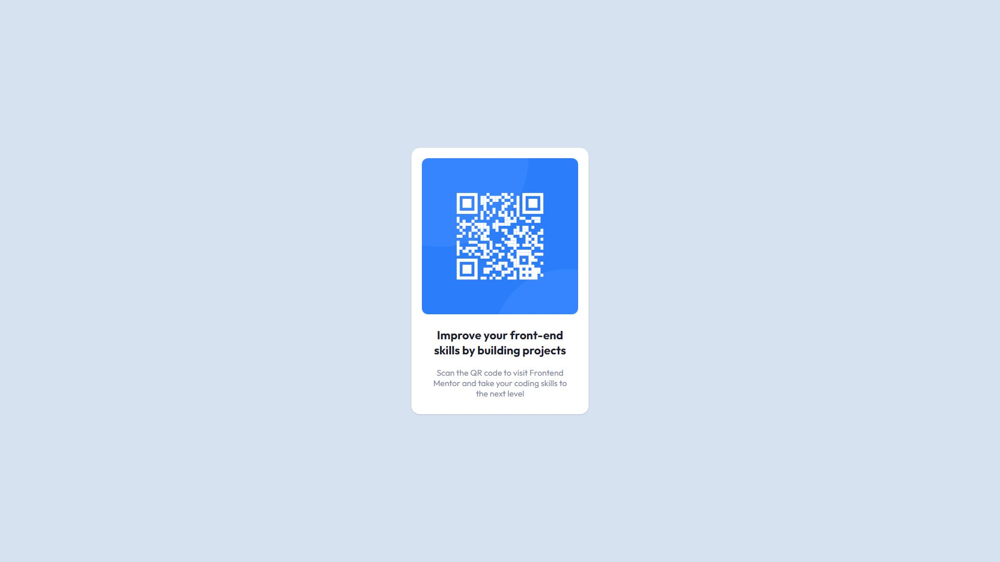

# Overview

## Screenshots

## Links

- [Solution (Frontend Mentor)](https://www.frontendmentor.io/solutions/simple-qr-scan-component-made-with-react-and-chakraui--cisbvP1Jc)
- [Live Site URL](https://kmartwork.github.io/simple-qr-scan/)

# My Process

I've been spending a lot of time building apps with React lately so I decided to stick with that as opposed to just writing vanilla JavaScript. I've also been wanting to get some more practice with various UI Libraries and I thought that this would be a perfect time to get more familiar with ChakraUI.

After looking at the design images and the style guide, I decided that the `Card` component from ChakraUI would most likely be the best fit for this exercise.

I slowly started piecing everything together and kept going back to reference their documentation and then putting a little more fine-tuning into the `App.css` stylesheet that comes with `create-react-app`.

## Built With
- React
- ChakraUI

## Useful Resources

- Getting Started with Chakra-UI: [https://chakra-ui.com/getting-started]

# Author
Kawika Miller